SAR Quick Analysis
===

24 hours analysis
---

The data used on this analysis comprises 24 hours of the day 2024-07-12. The GNSS receiver was located in an open-sky environment in Leuven, Belgium.

At the time of recording, all SAR messages received are of the `SHORT` type. Each message is transmitted in 4 nominal pages (2 seconds per page).

The majority of the messages received are of the `TEST_SERVICE` of SAR, not real incidents. Sorted by protocol, the vast majority are Orbitography messages, which are always of the `TEST_SERVICE` type. The other protocol received is the `RLS Location Protocol`.

For the RLS Location Protocol: 26.0% are from test beacons, 16.3% from ships, and 57.6% from PLB (Personal Location Beacons). There is also a breakdown by beacon country, although it does not necessarily mean the signal came from that country.

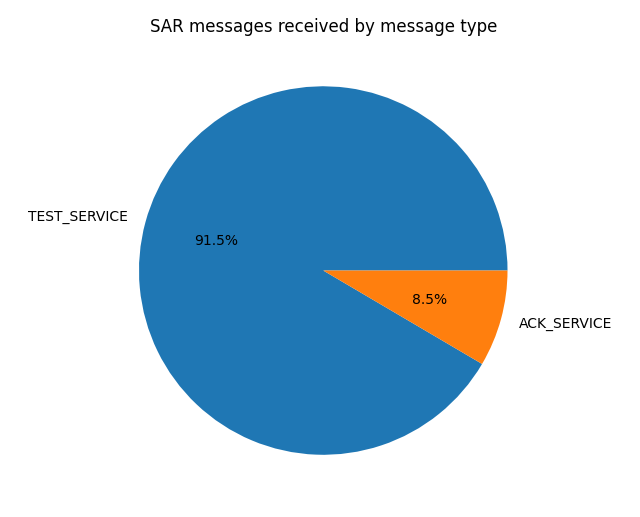

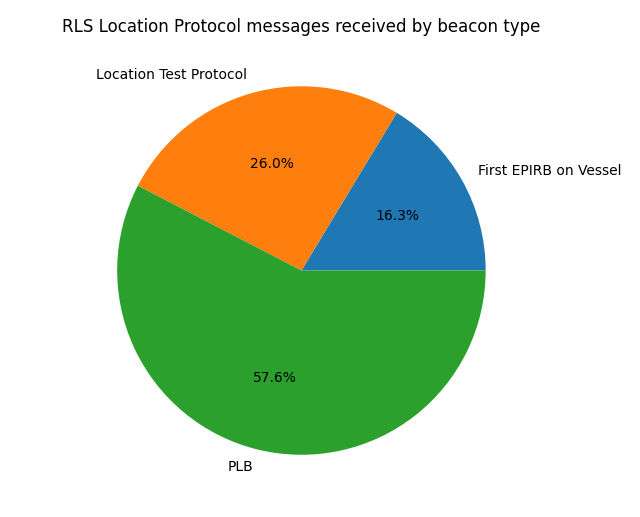
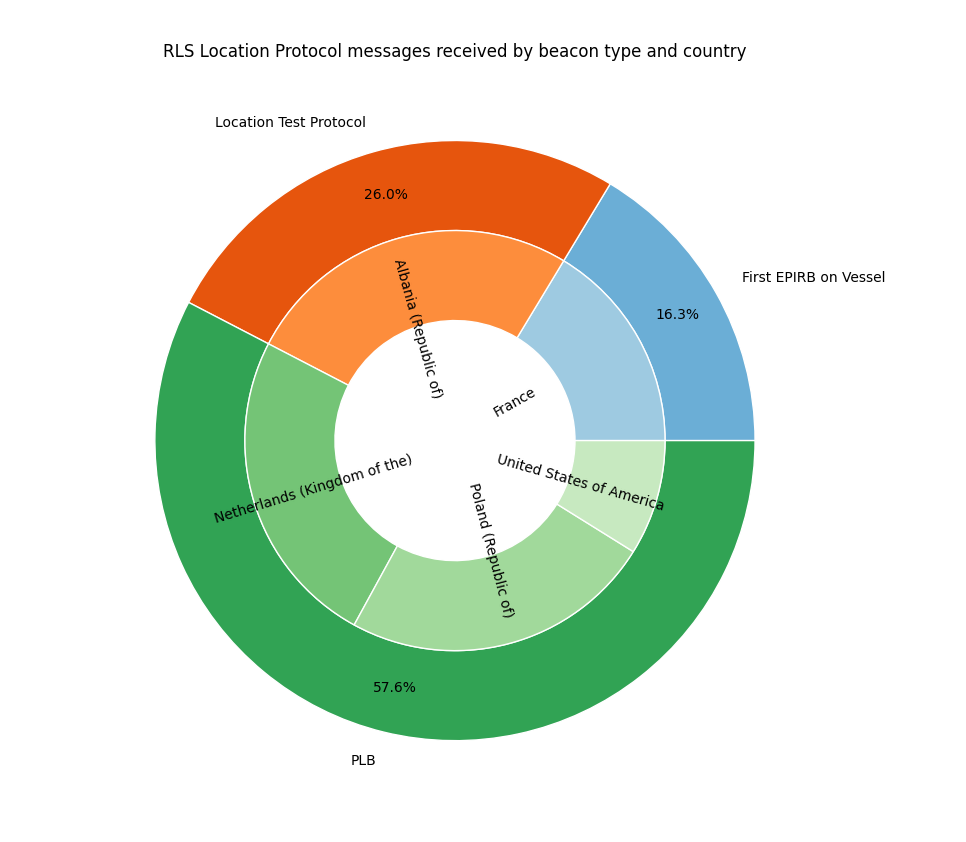

Orbitography
---

The satellites rely back orbitography messages from the ground stations in 10 bursts of 2 messages each from different satellites, with a separation of ~180s (3 minutes) between bursts.

Then the 10 bursts are separeted ~1980s (33 minutes).

There are a few missalignments. Some are because the satellite is not in view at my location. Others would require more research.

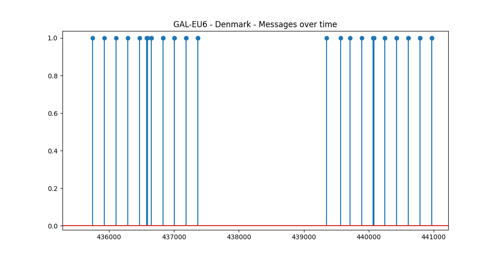
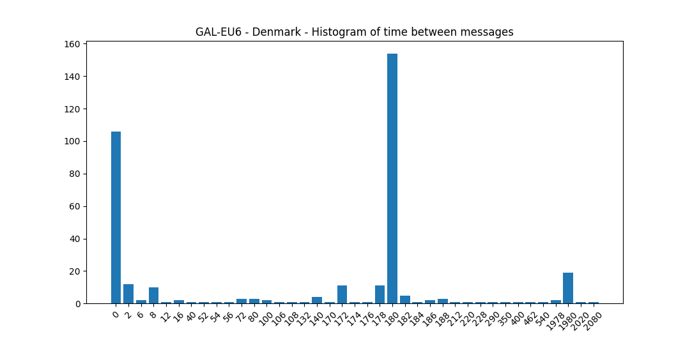
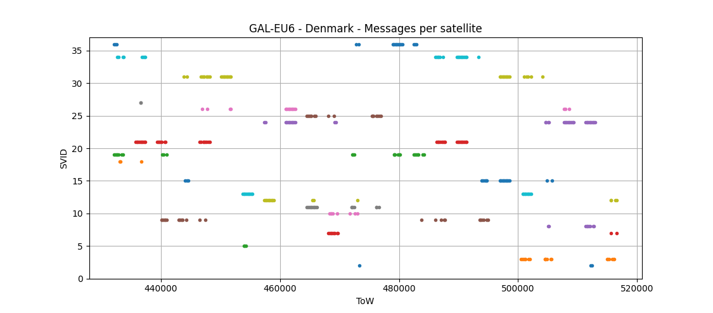

There is no clear pattern as for the satellite order. A possible theory is the closest X satellites to the base station, but more research is needed.

The station `V?????E` seems to be a test station since the beacon ID is not properly encoded and the trail bits that are supposed to be `0000` are a strange counter that changes with every 10 bursts.

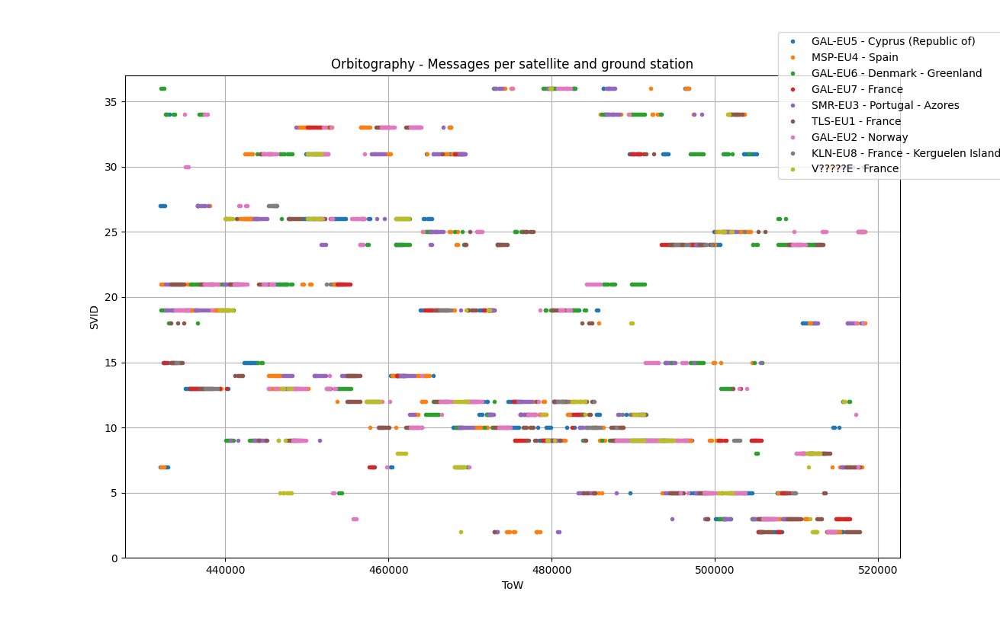
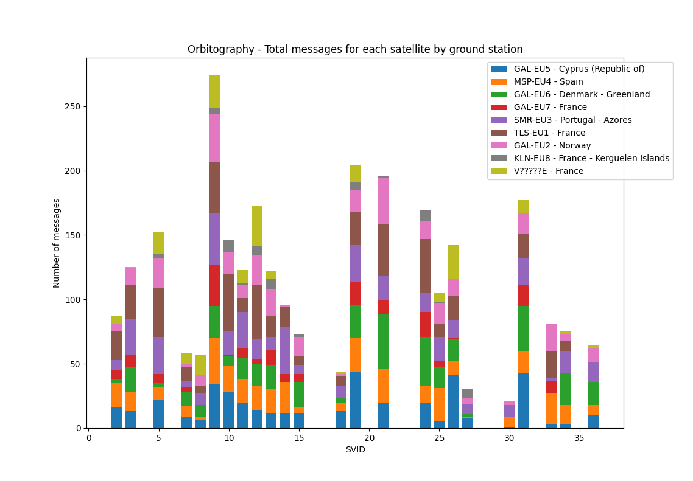

It is also interesting to analyze at what time within subframes do the satellites rely back the orbitography messages and if there is any pattern. A quick analisis shows that the orbitography messages tend to be send at the same offset withing 60 seconds (2 subframes).

The offset is **29 seconds** from the start of a GNSS minute. In other words, at the end of every other subframe. Note that the displayed time is the start of transmission time for the nominal page containing the last message fragment, and each message is composed of 4 fragments.

Therefore, **the satellites priorize the transmission of the orbitography messages on the last 4 nominal pages of every other GNSS subframe.**

However, **the satellites 11 (GSAT0101) and 12 (GSAT0102) transmit the message 1 page later**, at 31 seconds. It is unclear the reason of this behaviour, although these 2 satellites are the oldest ones currently usable. Maybe there is some scheduling protocol and when its full the older satellites transmit later.

There is no clear difference on the message offset regarding the ground station.

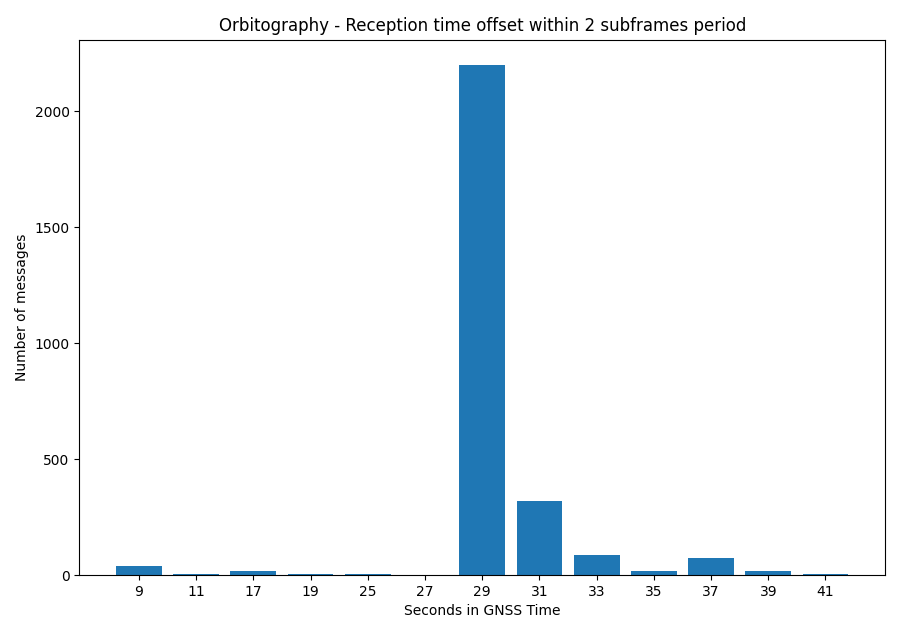
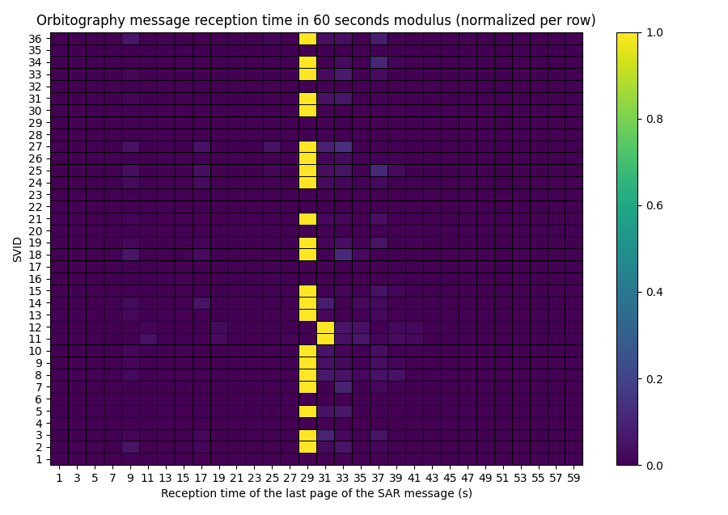
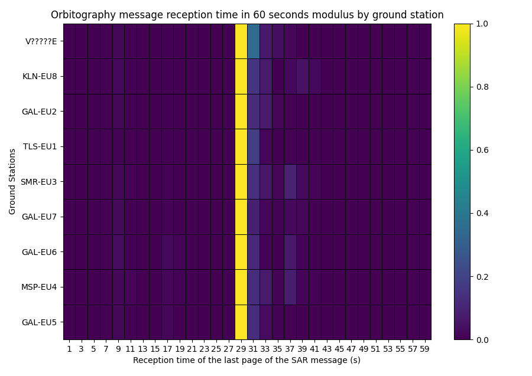

RLS Location Protocol messages
---

The RLS messages are transmitted from two satellites simultaneously, as described in the Galileo SAR SDD. This dual transmission can be seen in the time plot by SVID, although sometimes there's only one message received because the other satellite is not in view from the receiver location.

The RLS messages also have an offset in the transmission within 1 minute, in this case they are usually transmitted with an offset of **13 seconds**. Again, **the satellites 11 (GSAT0101) and 12 (GSAT0102) transmit the message 1 page later**.

There is one outlier with satellites 34 and 30. However, it may be an artifact of the few messages received in total.

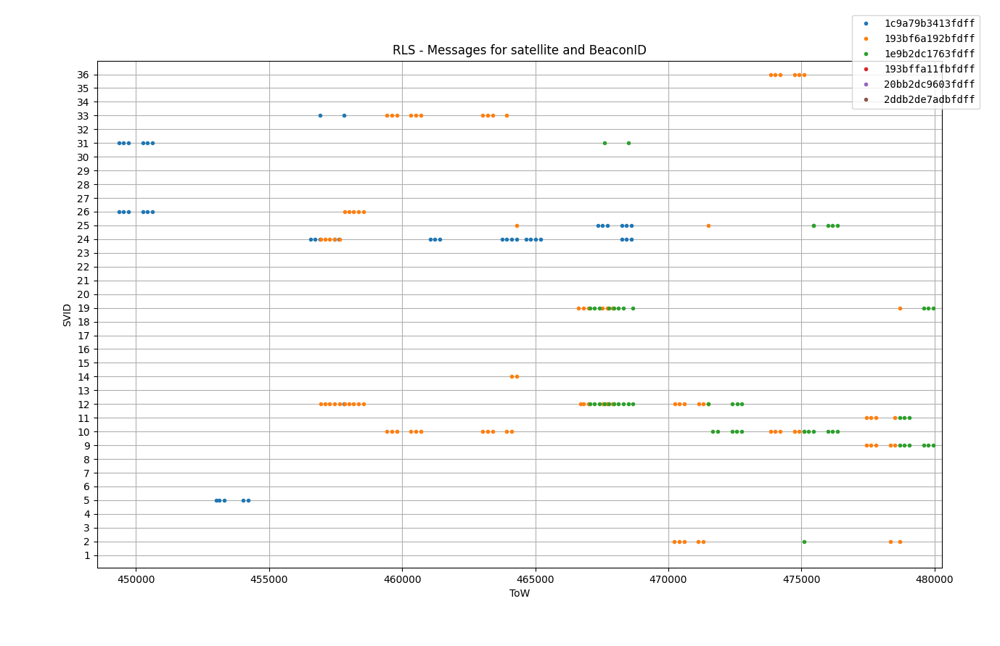
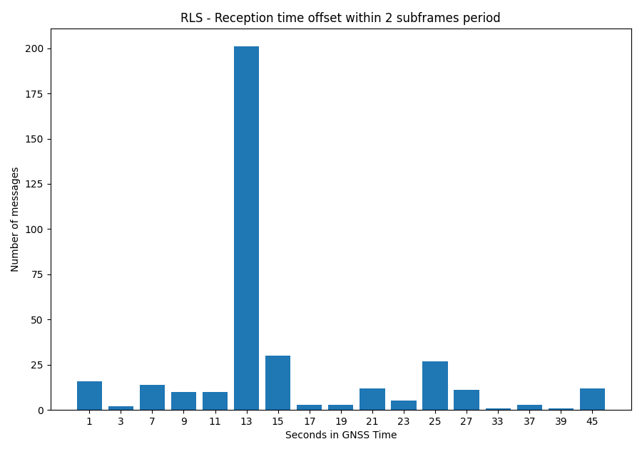
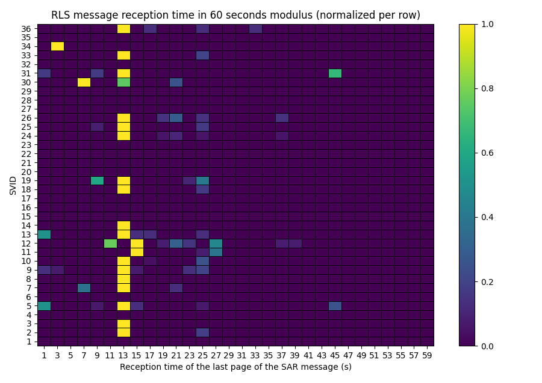

New data: 2024-08-24
===

Data collected on 2024-08-24 (~1 month later) show a similar behaviour.

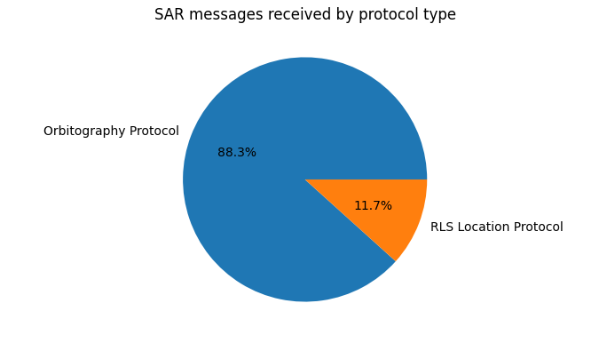
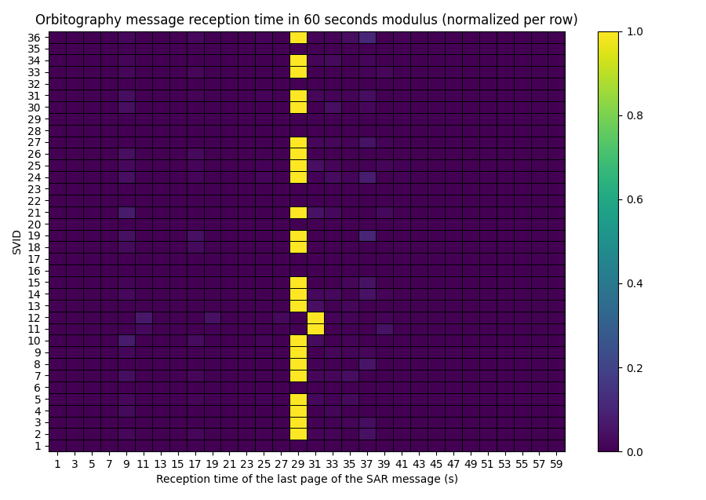
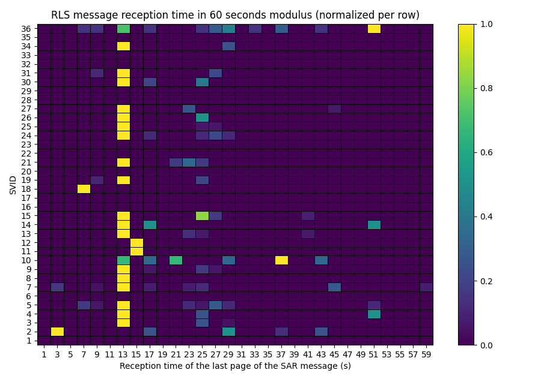
