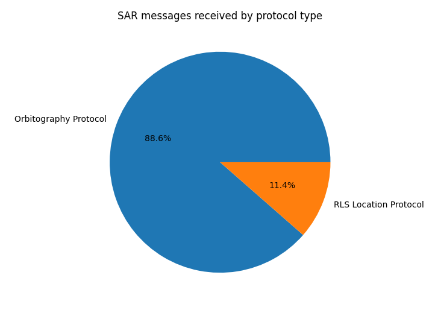
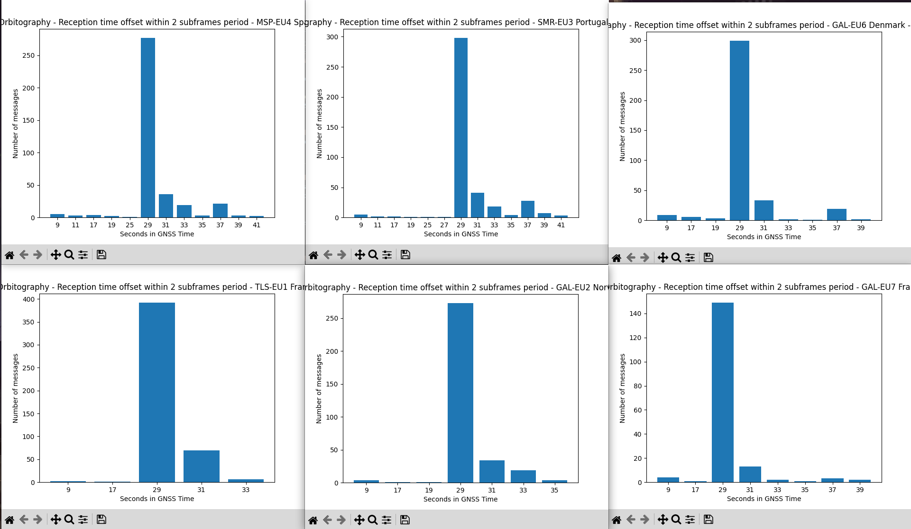

SAR Quick Analysis
===

24 hours analysis
---

The data used on this analysis comprises 24 hours of the day 2024-07-12. The GNSS receiver was located in an open-sky environment in Leuven, Belgium.

The majority of the messages received are of the `TEST_SERVICE` of SAR, not real incidents. By protocol, the vast majority are Orbitography messages, which are always of the `TEST_SERVICE` type. The other protocol received is the `RLS Location Protocol`.

For the RLS Location Protocol: 26.0% are from test beacons, 16.3% from ships, and 57.6% from PLB (Personal Location Beacons). There is also a breakdown by beacon country, although it does not necessarily mean the signal came from that country.

Orbitography
---

The ground stations transmit 10 bursts of 2 messages each for different satellites, with a separation of ~180s (3 minutes) between bursts.

Then the 10 bursts are separeted ~1980s (33 minutes).

There are a few missalignments. Some are because the satellite is not in view at my location. Others require more study (maybe RLS messages were transmitted at that time?).

There is no clear pattern as for the satellite order. A possible theory is the closest X satellites to the base station, but more research is needed.

The station `V?????E` seems to be a test station since the beacon ID is not properly encoded and the trail bits that are supposed to be `0000` are a strange counter that changes with every 10 bursts.

It is also interesting to analyze at what time withing subframes do the ground stations send the orbitography messages and if there is any pattern. A quick analisis shows that all the ground stations tend to send the messages at the same offset withing 60 seconds (2 subframes).

The offset is 29 seconds from the start of a GNSS minute. In other words, at the end of every other subframe. Note that the displayed time is the start of transmission time for the full page containing the last message fragment, and each message is composed of 4 fragments transmitted each on a consecutive full page.

Therefore, **the ground station priorize the transmission of the orbitography messages on the last 4 full pages of every other GNSS subframe.**

RLS Location Protocol messages
---

TBC
